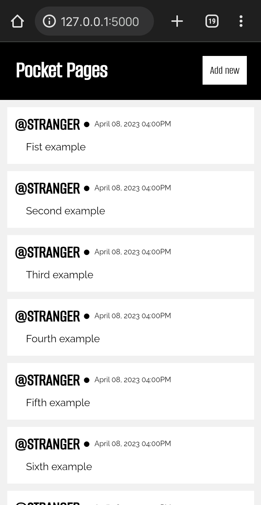
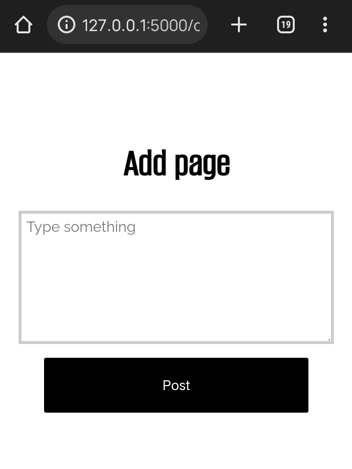

# pocket-pages

Create your own mini tweets and journals, and host it in your own browser! Powered by Python and Flask

## Screenshots
  


  

## Installation
1. Clone the repo
```
git clone https://github.com/im-strange/pocket-pages
```
2. Make sure the following python module are installed.
 - `flask`
 - `json`
 - `datetime`
 - `os`
 - `re`
3. Navigate to the folder.
```
cd pocket-pages
```
4. Update`data.json` file. Default details:
```json
{
  "name": "STRANGER",
  "host_ip": "127.0.0.1",
  "port": 5000
}
```
5. Run the script
```
python main.py
```
6. Open the link in your browser as followed by the information given in `data.json`.
Or, after running `main.py` you will see something in terminal:
```py
* Serving Flask app 'main'
* Debug mode: off
WARNING: This is a development server.
  Do not use it in a production deployment.
  Use a production WSGI server instead.
 * Running on http://127.0.0.1:5000
Press CTRL+C to quit
```
- copy the link like `http://127.0.0.1:5000`  
#
## More info
The tweeets(pages) are saved as `.txt` file in the `pocket_pages` folder.
Inside the `pocketpage.txt`, you will see something like this:

```
@STRANGER
April 8, 2023 04:20pm
First example
```
You may edit the contents of the saved files.
- first line must be the name
- second line is for date and time
- the rest is for body (content)  

You can delete tweets in the terminal with `rm` command   

Folder tree:
```
├── data.json
├── main.py
├── pocket_pages
│   ├── pocketpage-1.txt
│   ├── pocketpage-2.txt
│   ├── pocketpage-3.txt
│   ├── pocketpage-4.txt
│   ├── pocketpage-5.txt
│   ├── pocketpage-6.txt
│   └── pocketpage-7.txt
├── static
│   └── css
│       └── style.css
└── templates
    ├── blog.html
    └── create_blog.html
```
   

Note:
> *Use the repository's content only for legal and ethical purposes. Enjoy!*
